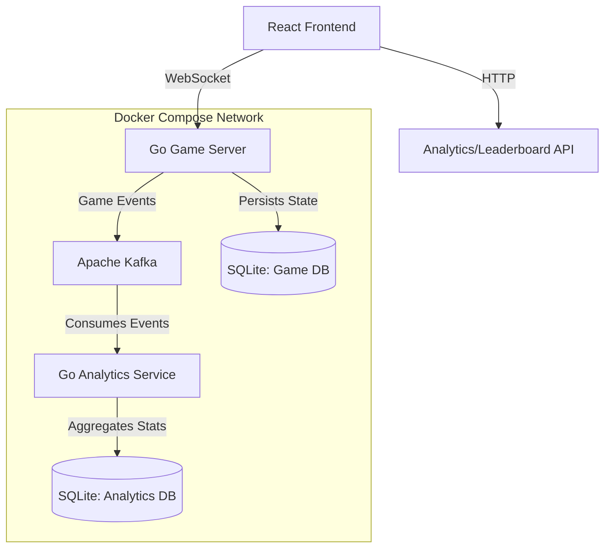

# Four-in-a-Row Game

A full-stack, real-time multiplayer implementation of the classic "Four in a Row" game. This project demonstrates a distributed architecture using Go, React, and Kafka.

## 🏗️ Architecture

The system uses a microservices-based approach with event-driven communication.



### Components

*   **Frontend (`client_side`)**: A React application using Vite, Zustand for state management, and Konva for rendering the game board. It communicates with the backend via WebSockets.
*   **Game Server (`4_rows_backend/cmd/server`)**: A Go server that handles WebSocket connections, game logic, move validation, and persistence of game state to SQLite (`game.db`). It produces gameplay events to Kafka.
*   **Analytics Service (`4_rows_backend/cmd/analytics`)**: A Go service that consumes events from Kafka, calculates statistics (e.g., win/loss records), and updates a separate SQLite database (`analytics.db`). It also generates the leaderboard.
*   **Message Broker**: Apache Kafka is used for decoupling the game logic from the analytics processing.

## 🛠️ Tech Stack

*   **Frontend**: React 19, Vite, TypeScript, TailwindCSS, Framer Motion, Konva, Howler.js (Audio).
*   **Backend**: Go (Golang), Gorilla WebSocket.
*   **Messaging**: Apache Kafka.
*   **Database**: SQLite (x2).
*   **Infrastructure**: Docker, Docker Compose.

## 📋 Prerequisites

*   **Docker Desktop** (or Docker Engine + Compose plugin)
*   **Node.js 18+** (for local frontend dev)
*   **Go 1.22+** (optional, for local backend dev)

## 🚀 Getting Started

### Option 1: Docker Compose (Recommended)

This initiates the entire backend infrastructure (Game Server, Analytics, Kafka, Databases).

1.  **Clone the repository:**
    ```bash
    git clone <repository-url>
    cd 4_rows_game
    ```

2.  **Start the Backend Services:**
    ```bash
    docker-compose up --build
    ```
    *   **Kafka** will start on port `9092` (internal) / `9093` (controller).
    *   **Game Server** will be available at `http://localhost:8080`.
    *   **Analytics Service** runs in the background.

3.  **Start the Frontend (Local):**
    Open a new terminal window.
    ```bash
    cd client_side
    npm install
    npm run dev
    ```
    *   The game is now accessible at `http://localhost:5173`.

### Option 2: Manual Setup (Local Development)

If you prefer to run services individually without Docker Compose (except Kafka, which is hard to run "bare metal"):

1.  **Start Kafka:**
    Use the helper compose file to run *only* Kafka.
    ```bash
    docker-compose -f docker-compose.kafka.yml up -d
    ```

2.  **Start the Game Server:**
    ```bash
    cd 4_rows_backend
    # Install dependencies
    go mod download
    # Run server
    go run cmd/server/main.go
    ```

3.  **Start the Analytics Service:**
    Open a new terminal.
    ```bash
    cd 4_rows_backend
    go run cmd/analytics/main.go
    ```

4.  **Start the Frontend:**
    Open a new terminal.
    ```bash
    cd client_side
    npm install
    npm run dev
    ```

## 📁 Project Structure

*   `client_side/`: Frontend React application.
*   `4_rows_backend/`:
    *   `cmd/`: Entry points for applications.
        *   `server/`: The main game server.
        *   `analytics/`: The analytics worker.
    *   `internal/`: Private application code (game logic, handlers, db access).
    *   `Dockerfile` & `Dockerfile.analytics`: Build instructions for services.
*   `docker-compose.yml`: Definition for the full stack.

## 🧪 Testing

*   **Frontend**: Run `npm test` in `client_side`.
*   **Backend**: Run `go test ./...` in `4_rows_backend`.
