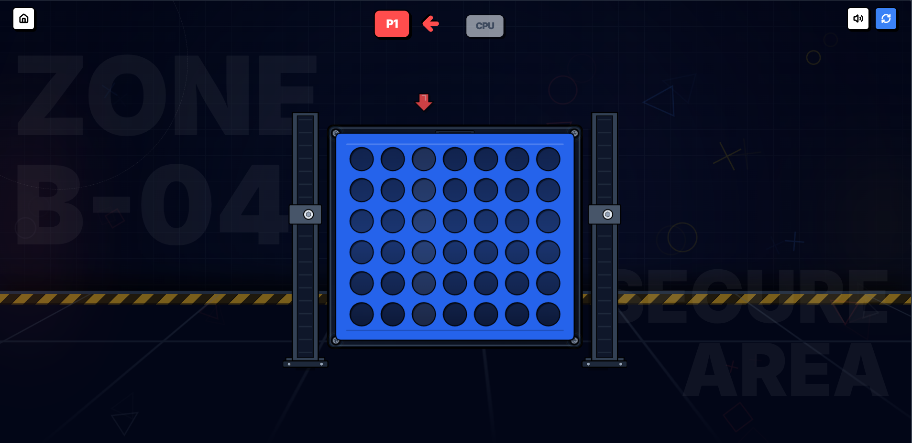

## Client Overview

Front-end for the Four-in-a-Row game built with React + Vite. The UI mixes Konva canvas rendering with Framer Motion for motion/FX and Zustand for state.

## Stack

- React 19 with Vite 6 (TypeScript)
- Zustand for game state
- react-konva + Konva for board rendering
- framer-motion for animation
- howler for audio hooks
- lucide-react for icons

## Folder Structure

- App shell: [App.tsx](App.tsx), [index.tsx](index.tsx)
- Styling: [index.css](index.css), [vercel.json](vercel.json) (deployment tweaks)
- Components: [components/BoardCanvas.tsx](components/BoardCanvas.tsx), [components/Controls.tsx](components/Controls.tsx), [components/Game.tsx](components/Game.tsx), [components/ModeSelection.tsx](components/ModeSelection.tsx), [components/StartScreen.tsx](components/StartScreen.tsx), [components/StatusDialog.tsx](components/StatusDialog.tsx)
- State: [store/gameStore.ts](store/gameStore.ts)
- Utilities: [utils/ai.ts](utils/ai.ts) (CPU move selection), [utils/winCheck.ts](utils/winCheck.ts)
- Types/config: [types.ts](types.ts), [vite.config.ts](vite.config.ts), [tsconfig.json](tsconfig.json), [metadata.json](metadata.json)

## Running Locally

1. Install deps: `npm install`
2. Start dev server: `npm run dev`
3. Open the shown local URL (default http://localhost:3000).
